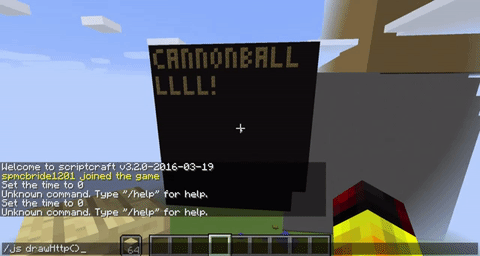

# Minecraft Terminal
Minecraft Terminal is a Scriptcraft-based terminal panel that renders the text returned from an HTTP GET request.

## Installation

### Client
1. Copy `minecraftTerminal.js` to your `./scriptcraft/plugins` directory
2. Reset Scriptcraft

### Server
1. run `npm install` in the `will-ferrell-server` directory
2. run `npm start` to start the server on port 3000

## How To Use
1. Log in as a user with op privileges
2. Open the Minecraft console
3. Run the command `/js drawHttp()`

## Considerations
* The panel is hardcoded to certain coordinates in the game world. Teleport to this location or adjust as needed
* The panel can target other HTTP endpoints by editing the scriptcraft plugin

## Video

